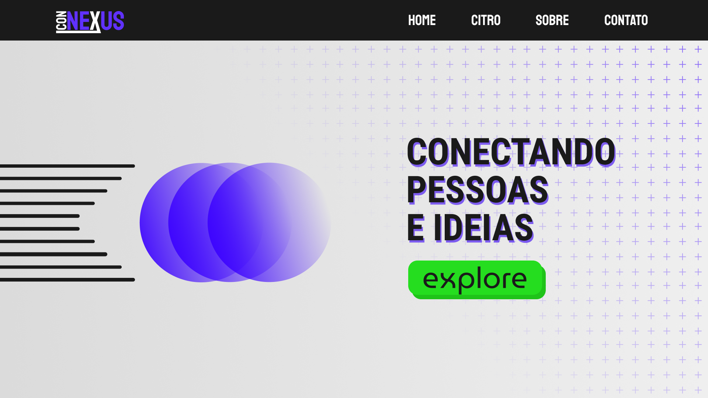

# Team Connexus

Uma breve descrição sobre o que esse projeto faz e para quem ele é

## Autores

- [@dieguesmosken](https://www.github.com/dieguesmosken)
- [@ruthmendonca](https://www.github.com/ruthmendonca)
- [@cailler](https://www.github.com/cailler)
- [@placeholder](https://www.github.com/placeholder)

## Paleta de cores

| Cor               | Hexadecimal                                                |
| ----------------- | ---------------------------------------------------------------- |
| Cor do Fundo      |  #1A1A1A |
| Cor de Texto 1    |  #6031FF |
| Cor de Texto 2    |  #25DD1F |
| Cor de Texto 3    |  #FFFFFF |

## Documentação

[Documentação](https://link-da-documentação)

## Screenshots

## Suporte

Para suporte, mande um email para <suporte@connexus.com> ou entre em nosso canal do (example).

## Referência

 - [Awesome Readme Templates](https://awesomeopensource.com/project/elangosundar/awesome-README-templates)
- [Awesome README](https://github.com/matiassingers/awesome-readme)
- [How to write a Good readme](https://bulldogjob.com/news/449-how-to-write-a-good-readme-for-your-github-project)

## Contribuindo

Contribuições são sempre bem-vindas!

Veja `contribuindo.md` para saber como começar.

Por favor, siga o `código de conduta` desse projeto.
